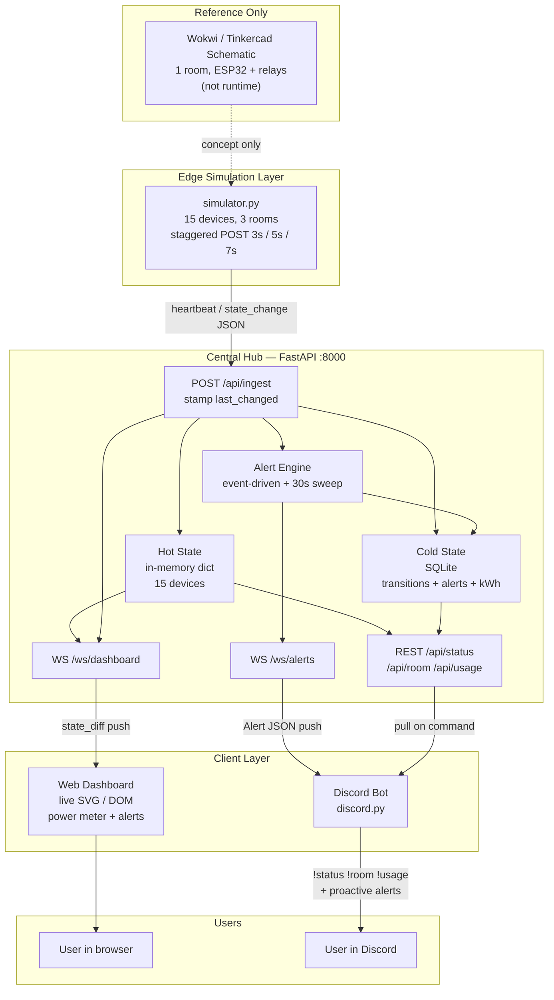
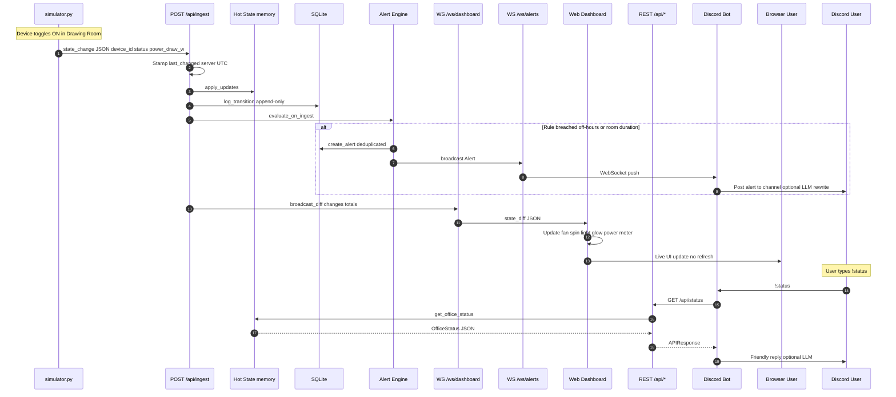
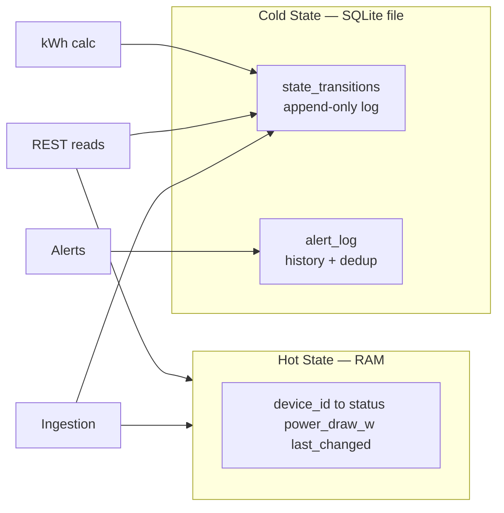
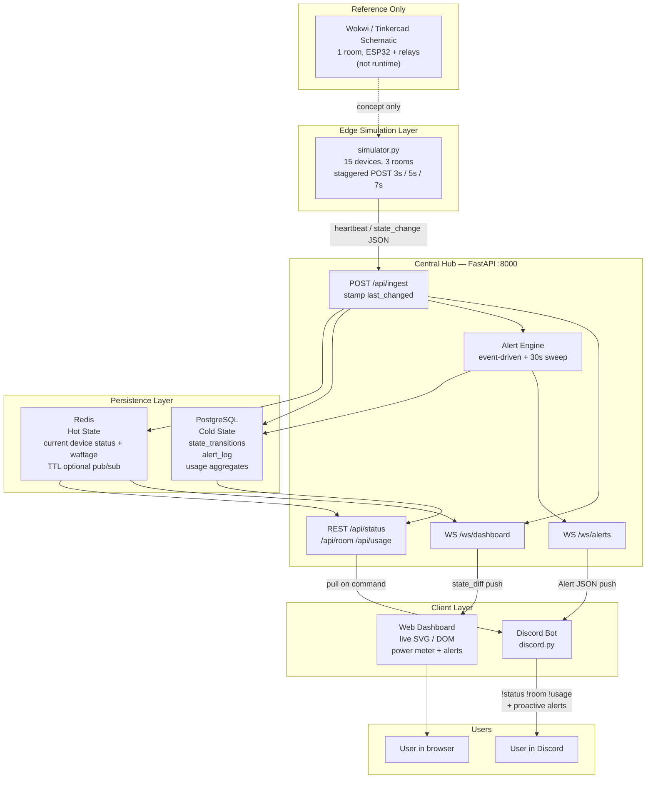
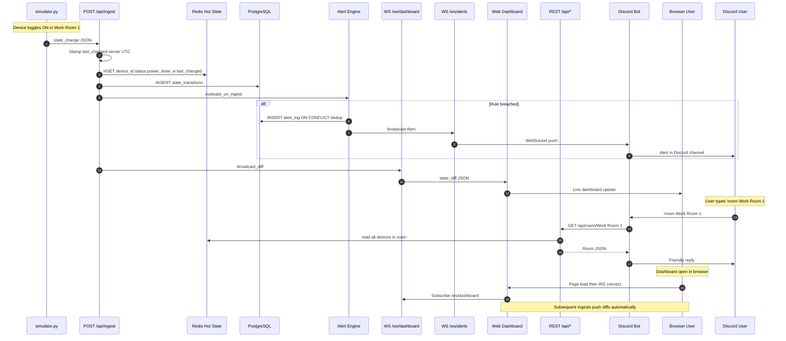
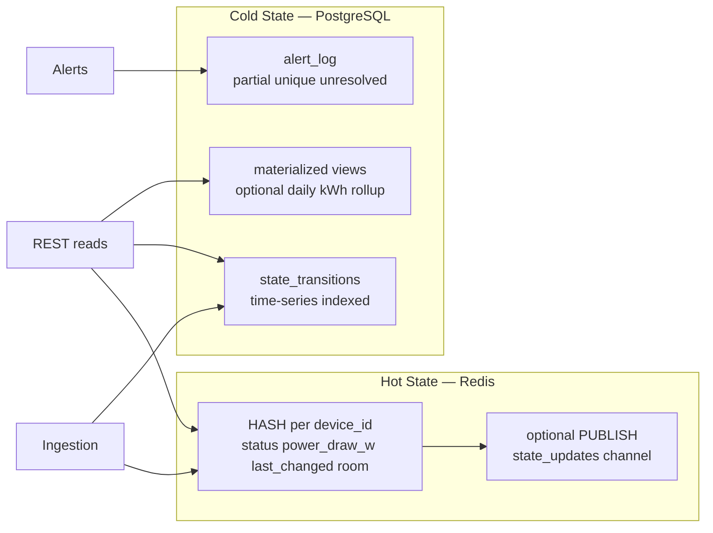
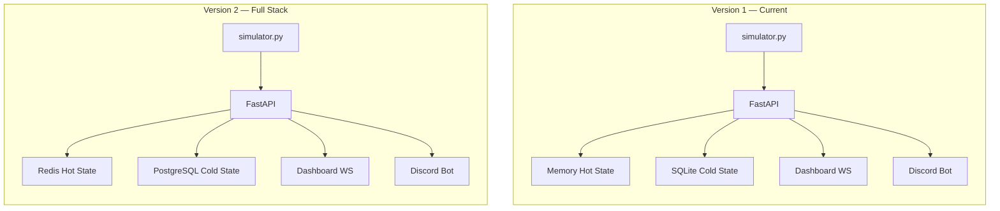
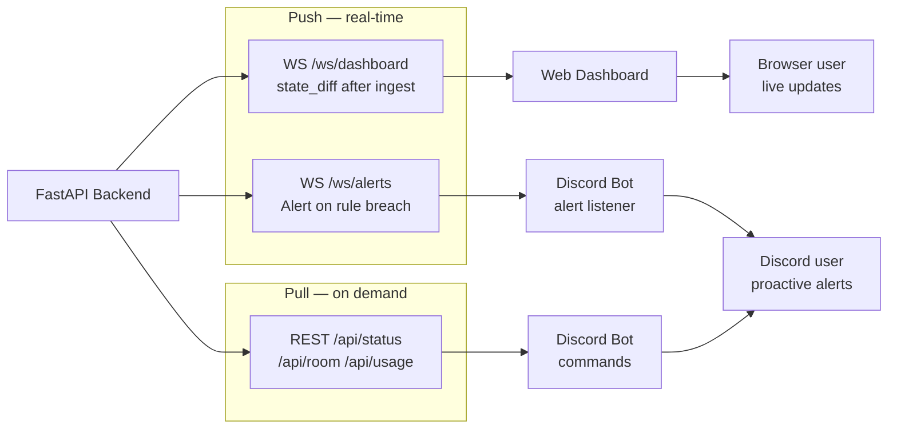

# High-Level System Diagrams (Phase 3 Complete)

These diagrams assume **Phase 3 is fully implemented**: `simulator.py` is running, the web dashboard frontend is live, and device state flows end to end from simulation to both the Discord bot and the live dashboard.

Two versions are shown:

| Version | Hot state | Cold state | When to use |
|---|---|---|---|
| **Version 1** | In-memory dict | SQLite | Current repo — simple local setup, zero extra infra |
| **Version 2** | Redis | PostgreSQL | Production-scale — persistence across restarts, multi-instance backend |

---

## Version 1 — In-Memory + SQLite (Current Stack)

No Redis. No PostgreSQL. Matches what is implemented today, extended with the Phase 3 simulator and dashboard frontend.

### System overview

### Full information flow — device state to user

End-to-end path when a device toggles ON in the simulator:

### Data stores — Version 1

---

## Version 2 — Redis + PostgreSQL (Full Stack)

All components implemented including Redis for hot state and PostgreSQL for cold state. Supports backend restarts without losing live state and horizontal scaling of FastAPI workers.

### System overview

### Full information flow — device state to user

### Data stores — Version 2

---

## Side-by-Side Comparison

| Aspect | Version 1 | Version 2 |
|---|---|---|
| Hot state | In-memory Python dict | Redis hashes |
| Cold state | SQLite file on disk | PostgreSQL server |
| Backend restart | Hot state resets to manifest defaults | Hot state survives in Redis |
| Multi-worker FastAPI | Shared state requires sticky sessions or single worker | Redis shared across workers |
| Setup complexity | Minimal — `pip install` + run | Requires Redis + Postgres services |
| Best for | Hackathon, local dev, demos | Production, multi-instance deployment |

---

## Communication Channels (Both Versions)

Both versions use the same **client-facing protocol** — only the persistence layer differs.

| Channel | Direction | Consumer | Payload |
|---|---|---|---|
| `POST /api/ingest` | Simulator → Backend | Ingestion gateway | `heartbeat` or `state_change` |
| `WS /ws/dashboard` | Backend → Dashboard | Browser | `state_diff` with changes + wattage totals |
| `WS /ws/alerts` | Backend → Discord bot | Bot alert task | `Alert` JSON (id, message, severity, created_at) |
| `GET /api/status` | Discord bot → Backend | On `!status` | `OfficeStatus` envelope |
| `GET /api/room/{name}` | Discord bot → Backend | On `!room` | `Room` envelope |
| `GET /api/usage` | Discord bot → Backend | On `!usage` | `Usage` envelope (from cold store) |

---

## Device → User Journey (Narrative)

This is the story both diagrams tell:

1. **Device state changes** in `simulator.py` (or a future real ESP32) — e.g. `work_room_1_fan_1` turns ON at 60W.
2. **Simulator sends JSON** to `POST /api/ingest` as a `state_change` payload.
3. **Backend stamps time**, writes to hot state (memory or Redis) and cold store (SQLite or PostgreSQL).
4. **Alert engine evaluates** rules immediately; periodic sweep catches time-only breaches.
5. **Dashboard path (push):** `/ws/dashboard` broadcasts a `state_diff` → frontend updates fan animation and power meter → **browser user sees live change**.
6. **Alert path (push):** if a rule fires → `/ws/alerts` pushes `Alert` JSON → Discord bot posts to alert channel → **Discord user sees proactive warning**.
7. **Command path (pull):** Discord user types `!status` → bot calls `GET /api/status` → reads hot state → LLM optionally rewrites → **Discord user sees current summary**.

---

## Related Documents

- [ARCHITECTURE.md](./ARCHITECTURE.md) — Design decisions and implementation status (Version 1)
- [SYSTEM_GUIDE.md](./SYSTEM_GUIDE.md) — How to run and test today
- [SIMULATOR.md](./SIMULATOR.md) — Phase 3 simulator guide
- [README.md](../README.md) — Onboarding and local setup
