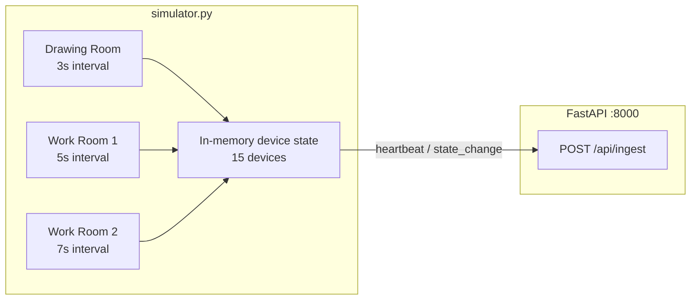

# Simulator Implementation Guide (Phase 3)

This document describes how to build `simulator/simulator.py` — the standalone Python script that emulates all 15 office devices and POSTs state updates to the FastAPI ingestion gateway.

**Prerequisites:** Phase 2 backend must be running with `POST /api/ingest` available.

---

## 1. Purpose

The simulator replaces manual `curl` calls as the runtime data source. It:

- Emulates **15 devices** (2 fans + 3 lights × 3 rooms)
- Sends **heartbeat** (full room sync) and **state_change** (diff) JSON to the backend
- Toggles devices probabilistically so the demo looks organic
- Uses **staggered intervals** per room so updates appear independent

The Wokwi/Tinkercad hardware schematic is a separate reference deliverable — it does not connect to this runtime system.

---

## 2. Where to Put It

```text
/
├── simulator/
│   ├── __init__.py
│   └── simulator.py      # Main entry point
└── examples/
    └── ingest_state_change.json   # Reference payload
```

Run from the repository root:

```powershell
python -m simulator.simulator
```

---

## 3. Target Architecture



---

## 4. Device Manifest

The simulator must use the **same device IDs** as the backend (`backend/app/state.py`). Do not invent new IDs.

| Room slug | Display name | Devices |
|---|---|---|
| `drawing_room` | Drawing Room | `drawing_room_fan_1`, `drawing_room_fan_2`, `drawing_room_light_1..3` |
| `work_room_1` | Work Room 1 | `work_room_1_fan_1`, `work_room_1_fan_2`, `work_room_1_light_1..3` |
| `work_room_2` | Work Room 2 | `work_room_2_fan_1`, `work_room_2_fan_2`, `work_room_2_light_1..3` |

### Suggested rated wattages

| Device type | `power_draw_w` when ON |
|---|---|
| `fan` | 60 |
| `light` | 15 |

When OFF, still send the rated `power_draw_w` value (the backend sets API wattage to `0` when status is `off`).

---

## 5. Payload Contract

POST to: `{API_BASE_URL}/api/ingest`

Content-Type: `application/json`

### Payload type 1: Heartbeat (full room sync)

Send periodically per room to resync all devices in that room.

```json
{
  "message_type": "heartbeat",
  "source_id": "esp32-drawing-room",
  "sequence": 1,
  "device_timestamp": "2026-07-04T14:00:00Z",
  "devices": [
    {
      "device_id": "drawing_room_light_1",
      "room": "drawing_room",
      "device_type": "light",
      "status": "off",
      "power_draw_w": 15
    },
    {
      "device_id": "drawing_room_fan_1",
      "room": "drawing_room",
      "device_type": "fan",
      "status": "off",
      "power_draw_w": 60
    }
  ]
}
```

### Payload type 2: State change (targeted diff)

Send when a single device toggles.

```json
{
  "message_type": "state_change",
  "source_id": "esp32-work-room-1",
  "sequence": 2,
  "device_timestamp": "2026-07-04T14:00:30Z",
  "changes": [
    {
      "device_id": "work_room_1_fan_1",
      "room": "work_room_1",
      "device_type": "fan",
      "status": "on",
      "power_draw_w": 60
    }
  ]
}
```

### Field rules

| Field | Rule |
|---|---|
| `message_type` | `"heartbeat"` or `"state_change"` |
| `source_id` | Unique per room ESP32, e.g. `esp32-drawing-room` |
| `sequence` | Increment per message per source |
| `device_timestamp` | ISO 8601 UTC; informational only — backend stamps `last_changed` |
| `status` | Lowercase `"on"` or `"off"` |
| `devices` / `changes` | List of device objects with `device_id`, `room`, `device_type`, `status`, `power_draw_w` |

---

## 6. Simulator Behavior

### 6.1 Staggered room intervals

Each room runs on its own timer so updates do not all fire at once:

| Room | Tick interval | `source_id` |
|---|---|---|
| Drawing Room | 3 seconds | `esp32-drawing-room` |
| Work Room 1 | 5 seconds | `esp32-work-room-1` |
| Work Room 2 | 7 seconds | `esp32-work-room-2` |

### 6.2 State-change logic (probabilistic)

On each room tick:

1. With a small probability (e.g. 15–25%), pick one random device in that room and toggle its status.
2. If a device toggled, send a **`state_change`** payload with only that device in `changes`.
3. If no device toggled, optionally send a **`heartbeat`** with all devices in that room (recommended every N ticks for resync).

This produces organic-looking activity instead of a fixed on/off schedule.

### 6.3 Initial startup

On startup, send one **heartbeat per room** with all devices `off` so the backend hot state is aligned before random toggling begins.

---

## 7. Recommended Implementation Structure

```python
# simulator/simulator.py (skeleton)

import asyncio
import os
import random
from datetime import UTC, datetime

import httpx

API_BASE_URL = os.getenv("SIMULATOR_API_URL", "http://127.0.0.1:8000")
TOGGLE_PROBABILITY = float(os.getenv("SIMULATOR_TOGGLE_PROB", "0.2"))

ROOMS = {
    "drawing_room": {"interval": 3, "source_id": "esp32-drawing-room"},
    "work_room_1": {"interval": 5, "source_id": "esp32-work-room-1"},
    "work_room_2": {"interval": 7, "source_id": "esp32-work-room-2"},
}

# Build device list from same IDs as backend/app/state.py
# Track per-room sequence counters
# Track per-device status and power_draw_w in memory


async def post_ingest(client: httpx.AsyncClient, payload: dict) -> None:
    response = await client.post(f"{API_BASE_URL}/api/ingest", json=payload)
    response.raise_for_status()


async def room_loop(
    client: httpx.AsyncClient,
    room_slug: str,
    config: dict,
    devices: list[dict],
    sequences: dict[str, int],
) -> None:
    while True:
        # Maybe toggle one device
        # Build state_change or heartbeat payload
        # await post_ingest(client, payload)
        await asyncio.sleep(config["interval"])


async def main() -> None:
    async with httpx.AsyncClient(timeout=10.0) as client:
        # Send initial heartbeats
        # asyncio.gather(room_loop(...) for each room)
        ...


if __name__ == "__main__":
    asyncio.run(main())
```

---

## 8. Environment Variables

Add to a `simulator/.env.example` or document in the root README:

| Variable | Default | Description |
|---|---|---|
| `SIMULATOR_API_URL` | `http://127.0.0.1:8000` | Backend base URL |
| `SIMULATOR_TOGGLE_PROB` | `0.2` | Probability of toggling a device per room tick |

---

## 9. How to Run and Test

### Step 1 — Start the backend

```powershell
uvicorn backend.app.main:app --host 127.0.0.1 --port 8000 --reload
```

### Step 2 — Start the simulator

```powershell
python -m simulator.simulator
```

### Step 3 — Verify

```powershell
# Status should change over time
Invoke-RestMethod http://127.0.0.1:8000/api/status

# Usage should accumulate
Invoke-RestMethod http://127.0.0.1:8000/api/usage
```

### Step 4 — Verify Discord bot

```text
!status
!room Drawing Room
!usage
```

Values should match the API and update as the simulator runs.

### Step 5 — Verify alerts

For quick demo, set in `backend/.env`:

```env
DURATION_THRESHOLD_SECONDS=20
```

Leave all devices in one room ON (or wait for the simulator to do it) and confirm:
- Alert appears on `/ws/alerts`
- Discord bot posts to the alert channel

---

## 10. Testing Checklist

| # | Test | Expected |
|---|---|---|
| 1 | Simulator starts without errors | HTTP 200 from ingest |
| 2 | `GET /api/status` after 30s | Wattage values change |
| 3 | Drawing Room updates every ~3s | Visible in status or live WS |
| 4 | Work Room 1 updates every ~5s | Independent from Drawing Room |
| 5 | Work Room 2 updates every ~7s | Independent from other rooms |
| 6 | `state_change` on toggle | Only changed device in `updated` response |
| 7 | `heartbeat` on resync | All room devices in payload |
| 8 | Unknown `device_id` | Never sent — use manifest IDs only |
| 9 | Backend restart | Simulator heartbeats resync state |
| 10 | Discord `!status` | Matches API while simulator runs |

---

## 11. Dependencies

`httpx` is already in `requirements.txt`. No new packages required unless you want CLI extras (`click`, `rich`, etc.).

---

## 12. Optional Enhancements

- **CLI flags:** `--url`, `--probability`, `--room drawing_room` (single-room mode for debugging)
- **Logging:** Print each POST with sequence number and response `updated` list
- **Live WS client:** A small test script subscribing to `/ws/live` to print diffs
- **Deterministic test mode:** `--seed 42` for reproducible demos

---

## 13. Related Documents

- [SYSTEM_GUIDE.md](./SYSTEM_GUIDE.md) — Full system overview and manual testing
- [ARCHITECTURE.md](./ARCHITECTURE.md) — Original architecture and alert design
- [`examples/ingest_state_change.json`](../examples/ingest_state_change.json) — Sample ingest payload
