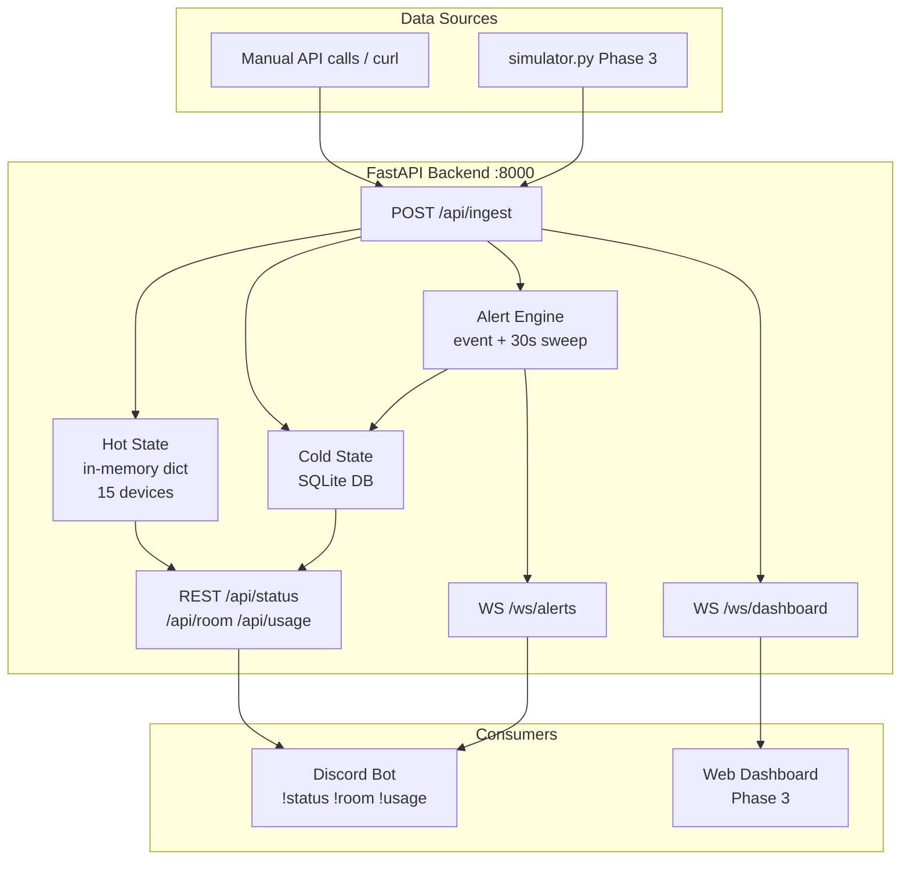
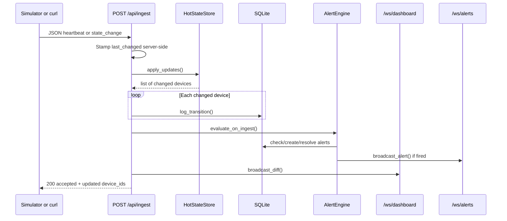
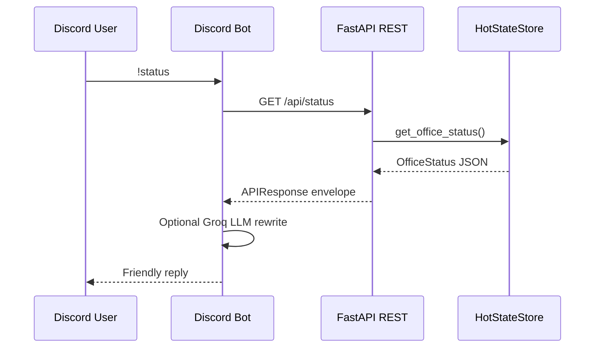
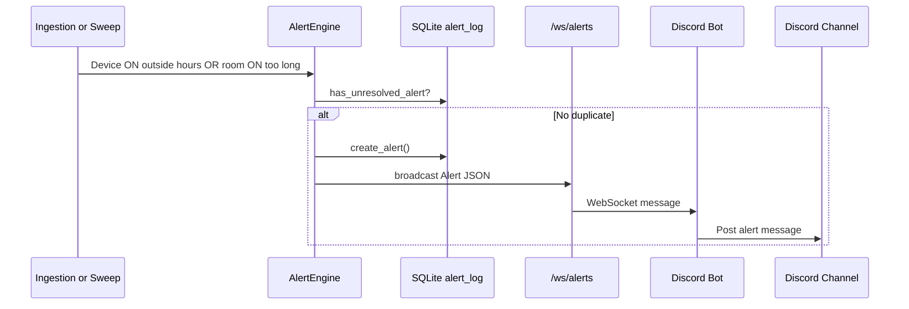

# Office Energy Monitoring System — System Guide

This document describes how the full system works after **Phase 2**, and how to run and test it end to end.

**Current status**

| Component | Status |
|---|---|
| FastAPI backend (hot state, SQLite, ingestion, alerts) | Implemented (Phase 2) |
| Discord bot (REST commands + alert WebSocket listener) | Implemented (Phase 1) |
| Shared Pydantic API contracts | Implemented (Phase 1) |
| `simulator.py` (device emulator) | Planned (Phase 3) |
| Web dashboard frontend | Planned (Phase 3) |
| Redis / PostgreSQL | Deferred (Phase 3+) |

---

## 1. High-Level Architecture

The FastAPI backend is the **single source of truth**. All device state flows in through the ingestion gateway, is stored in hot memory for real-time reads, and logged to SQLite for history, usage math, and alert de-duplication. The Discord bot reads status via REST and receives proactive alerts via WebSocket.



---

## 2. End-to-End Process Flow

### 2.1 Ingestion flow (state change)



### 2.2 Discord bot command flow



### 2.3 Proactive alert flow



---

## 3. Device Inventory

The system tracks **15 devices** across **3 rooms** (2 fans + 3 lights per room).

| Room slug (ingestion) | Display name (API / bot) |
|---|---|
| `drawing_room` | Drawing Room |
| `work_room_1` | Work Room 1 |
| `work_room_2` | Work Room 2 |

**Device ID pattern:** `{room_slug}_{device_type}_{n}`

Examples:
- `drawing_room_fan_1`
- `work_room_1_light_3`

All devices start **OFF** with `power_draw_w: 0` until the first ingest updates them.

---

## 4. State Layers

### Hot state (in-memory)

- **File:** `backend/app/state.py`
- **Key:** `device_id`
- **Fields:** `room`, `device_type`, `status` (`on`/`off`), `power_draw_w`, `last_changed`
- **Used for:** `/api/status`, `/api/room/{name}`, alert duration checks, dashboard WebSocket diffs
- **Wattage rule:** API `wattage` = `power_draw_w` when ON, else `0`

### Cold state (SQLite)

- **File:** `backend/app/persistence/database.py`
- **Database path:** `data/office_energy.db` (configurable via `SQLITE_PATH`)
- **Tables:**
  - `state_transitions` — append-only log of every state change (for kWh and history)
  - `alert_log` — fired alerts with de-duplication (unresolved = `resolved_at IS NULL`)
- **Used for:** `/api/usage` kWh calculation, alert history, preventing duplicate alerts

---

## 5. Alert Engine

**File:** `backend/app/alerts.py`

Two independent evaluation paths feed the same alert creation logic:

| Path | When | Purpose |
|---|---|---|
| **Event-driven** | Every `POST /api/ingest` | Immediate check when a device changes state |
| **Periodic sweep** | Every 30 seconds (background task) | Catches time-based breaches (e.g. office hours end while device stays ON) |

### Alert rules

| Rule | Condition | Target |
|---|---|---|
| **Off-hours** | Device is `on` outside `OFFICE_START`–`OFFICE_END` | `device_id` |
| **Room duration** | All devices in a room are `on` continuously for longer than `DURATION_THRESHOLD` | room slug |

### De-duplication

Before firing, the engine checks SQLite for an existing **unresolved** alert with the same `alert_type` + `target`. Alerts auto-resolve when the condition clears (device turns off, office hours resume, or any room device turns off).

### Demo mode

Shrink thresholds in `backend/.env` for quick demos:

```env
DURATION_THRESHOLD_SECONDS=20
OFFICE_START=09:00
OFFICE_END=17:00
```

---

## 6. API Reference

Base URL: `http://127.0.0.1:8000`

### REST — Bot / status

| Method | Path | Description |
|---|---|---|
| `GET` | `/api/status` | Full office status (all rooms, total wattage) |
| `GET` | `/api/room/{room_name}` | Single room (accepts `Drawing Room` or `drawing_room`) |
| `GET` | `/api/usage` | Daily / weekly / monthly kWh from SQLite |
| `GET` | `/api/health` | Server health and version |
| `POST` | `/api/ingest` | Ingest device state (heartbeat or state_change) |

### WebSockets

| Path | Description |
|---|---|
| `WS /ws/alerts` | Real-time alert stream (Discord bot subscribes here) |
| `WS /ws/dashboard` | Hot-state diffs after each ingest (for future dashboard) |

### Ingestion payload types

**Heartbeat** (full room sync):

```json
{
  "message_type": "heartbeat",
  "source_id": "esp32-drawing-room",
  "sequence": 1,
  "device_timestamp": "2026-07-04T14:00:00Z",
  "devices": [
    {
      "device_id": "drawing_room_light_1",
      "room": "drawing_room",
      "device_type": "light",
      "status": "off",
      "power_draw_w": 15
    }
  ]
}
```

**State change** (targeted diff):

```json
{
  "message_type": "state_change",
  "source_id": "esp32-work-room-1",
  "sequence": 2,
  "device_timestamp": "2026-07-04T14:00:30Z",
  "changes": [
    {
      "device_id": "work_room_1_fan_1",
      "room": "work_room_1",
      "device_type": "fan",
      "status": "on",
      "power_draw_w": 60
    }
  ]
}
```

> **Note:** `device_timestamp` is logged but **not** used for time math. The server always stamps `last_changed` on receipt to avoid clock skew.

---

## 7. Running the System

### Prerequisites

```powershell
python -m venv .venv
.venv\Scripts\activate
pip install -r requirements.txt
```

### Configure environment

```powershell
copy backend\.env.example backend\.env
copy bot\.env.example bot\.env
```

Edit `bot\.env` with your Discord token, channel ID, and optional Groq key. See [DISCORD_BOT_SETUP.md](../DISCORD_BOT_SETUP.md) for full bot setup.

### Start the backend

```powershell
uvicorn backend.app.main:app --host 127.0.0.1 --port 8000 --reload
```

### Start the Discord bot (optional)

```powershell
python -m bot.bot
```

### Start the simulator (Phase 3)

Not yet implemented. See [SIMULATOR.md](./SIMULATOR.md) for the implementation guide.

---

## 8. How to Test

### 8.1 Automated tests (pytest)

```powershell
pytest
```

| Test file | What it covers |
|---|---|
| `tests/test_api_routes.py` | Phase 1 REST routes (mock repository override) |
| `tests/test_phase2.py` | Ingestion, alerts, usage, WebSockets (real stack) |
| `tests/test_repository.py` | Mock repository unit tests |
| `tests/test_service.py` | Bot service layer |
| `tests/test_api_client.py` | Bot HTTP client |
| `tests/test_bot_formatting.py` | Discord message formatting |
| `tests/test_llm_client.py` | Groq LLM client |

Run only Phase 2 tests:

```powershell
pytest tests/test_phase2.py -v
```

### 8.2 Manual API testing (PowerShell)

> **PowerShell tip:** `curl` is an alias for `Invoke-WebRequest`. Use `curl.exe` for real curl, or `Invoke-RestMethod` for native PowerShell.

#### Ingest a state change (recommended: JSON file)

A sample payload is at [`examples/ingest_state_change.json`](../examples/ingest_state_change.json):

```powershell
curl.exe -X POST "http://127.0.0.1:8000/api/ingest" `
  -H "Content-Type: application/json" `
  --data-binary "@examples/ingest_state_change.json"
```

Expected response:

```json
{"accepted":1,"updated":["work_room_1_fan_1"]}
```

#### Ingest with single-quoted JSON

```powershell
curl.exe -X POST "http://127.0.0.1:8000/api/ingest" `
  -H "Content-Type: application/json" `
  -d '{"message_type":"state_change","source_id":"esp32-work-room-1","sequence":1,"device_timestamp":"2026-07-04T14:00:30Z","changes":[{"device_id":"work_room_1_fan_1","room":"work_room_1","device_type":"fan","status":"on","power_draw_w":60}]}'
```

#### Ingest with Invoke-RestMethod

```powershell
$body = @{
  message_type     = "state_change"
  source_id        = "esp32-work-room-1"
  sequence         = 1
  device_timestamp = "2026-07-04T14:00:30Z"
  changes          = @(
    @{
      device_id    = "work_room_1_fan_1"
      room         = "work_room_1"
      device_type  = "fan"
      status       = "on"
      power_draw_w = 60
    }
  )
} | ConvertTo-Json -Depth 5

Invoke-RestMethod -Uri "http://127.0.0.1:8000/api/ingest" -Method POST -ContentType "application/json" -Body $body
```

#### Read status and usage

```powershell
Invoke-RestMethod http://127.0.0.1:8000/api/status
Invoke-RestMethod http://127.0.0.1:8000/api/usage
Invoke-RestMethod "http://127.0.0.1:8000/api/room/Drawing%20Room"
```

After turning on `work_room_1_fan_1` at 60W, `/api/status` should show `total_wattage: 60`.

### 8.3 Test checklist

| # | Action | Expected result |
|---|---|---|
| 1 | `POST /api/ingest` state_change (fan ON) | `200`, device in `updated` list |
| 2 | `GET /api/status` | Fan shows `ON`, wattage matches `power_draw_w` |
| 3 | `GET /api/usage` | kWh increases after device has been ON |
| 4 | Ingest unknown `device_id` | `422` validation error |
| 5 | Turn device ON outside office hours | Alert appears on `/ws/alerts` |
| 6 | Turn all 5 devices ON in one room for > threshold | Room duration alert fires |
| 7 | `!status` in Discord | Matches `/api/status` data |
| 8 | Alert fires | Bot posts to configured alert channel |

### 8.4 Test off-hours alert quickly

Set office hours so the current time is always "outside hours" in `backend/.env`:

```env
OFFICE_START=23:59
OFFICE_END=23:59
```

Restart the backend, ingest a device with `"status": "on"`, then check the Discord alert channel or connect to `ws://127.0.0.1:8000/ws/alerts`.

### 8.5 Test room duration alert quickly

```env
DURATION_THRESHOLD_SECONDS=20
```

Turn all 5 devices in one room ON (via ingest), wait up to 30 seconds for the periodic sweep, and confirm an alert fires.

### 8.6 Test Discord bot

1. Start backend and bot.
2. In Discord:
   - `!status` — full office summary
   - `!room Drawing Room` — single room
   - `!usage` — energy usage
3. Trigger an off-hours or duration alert and confirm the bot posts to the alert channel.

Full bot setup: [DISCORD_BOT_SETUP.md](../DISCORD_BOT_SETUP.md)

---

## 9. Repository Layout

```text
/
├── shared/models/          # Pydantic API contracts (do not break)
├── backend/app/
│   ├── main.py             # App factory + lifespan
│   ├── config.py           # Env-based thresholds
│   ├── state.py            # Hot state + device manifest
│   ├── alerts.py           # Alert engine
│   ├── persistence/        # SQLite cold state
│   ├── schemas/ingestion.py
│   ├── api/
│   │   ├── bot.py          # REST for Discord bot
│   │   ├── ingest.py       # POST /api/ingest
│   │   └── websocket.py    # /ws/alerts, /ws/dashboard
│   ├── repositories/
│   │   ├── mock_repository.py   # Phase 1 tests only
│   │   └── real_repository.py   # Phase 2 production
│   └── websocket/          # WebSocket managers
├── bot/                    # Discord bot (unchanged in Phase 2)
├── examples/               # Sample ingest JSON
├── tests/
└── doc/
    ├── ARCHITECTURE.md     # Original architecture spec
    ├── SYSTEM_GUIDE.md     # This file
    └── SIMULATOR.md        # Phase 3 simulator guide
```

---

## 10. Environment Variables

### Backend (`backend/.env`)

| Variable | Default | Description |
|---|---|---|
| `HOST` | `127.0.0.1` | Bind host |
| `PORT` | `8000` | Bind port |
| `DEBUG` | `false` | Debug logging |
| `OFFICE_START` | `09:00` | Office hours start (HH:MM) |
| `OFFICE_END` | `17:00` | Office hours end (HH:MM) |
| `DURATION_THRESHOLD_SECONDS` | `7200` | Room all-ON alert threshold |
| `ALERT_SWEEP_INTERVAL_SECONDS` | `30` | Periodic alert sweep interval |
| `SQLITE_PATH` | `data/office_energy.db` | SQLite database file |

### Bot (`bot/.env`)

| Variable | Description |
|---|---|
| `DISCORD_TOKEN` | Bot token from Discord Developer Portal |
| `API_BASE_URL` | Backend URL (e.g. `http://127.0.0.1:8000`) |
| `ALERT_CHANNEL_ID` | Channel for proactive alerts |
| `COMMAND_PREFIX` | Command prefix (default `!`) |
| `GROQ_API_KEY` | Optional Groq API key for LLM replies |
| `GROQ_MODEL` | Groq model name |
| `LLM_ENABLED` | `true` / `false` |

---

## 11. Related Documents

- [ARCHITECTURE.md](./ARCHITECTURE.md) — Original system design and engineering trade-offs
- [SIMULATOR.md](./SIMULATOR.md) — How to build `simulator.py` (Phase 3)
- [DISCORD_BOT_SETUP.md](../DISCORD_BOT_SETUP.md) — Discord bot configuration
